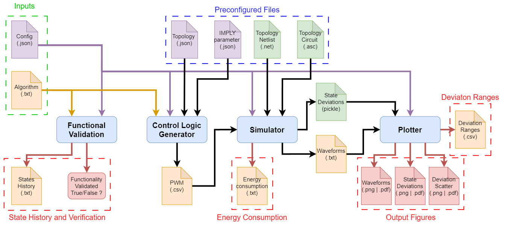
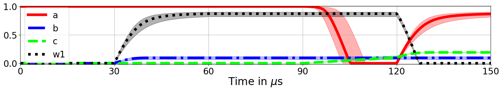
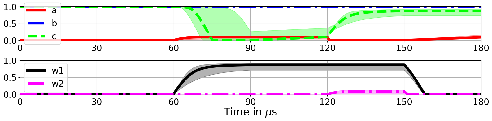
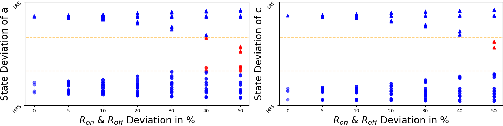
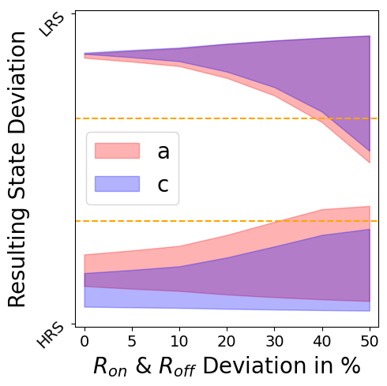

<!--# ATOMIC-SAVE: Automatic Tool for Memristive IMPLY-based Circuit-level Simulation and Validation-->
# ATOMIC: Automatic Tool for Memristive IMPLY-based Circuit-level Simulation and Validation

An automatic validation, evaluation, and plotting tool for memristive IMPLY-based In-Memory Computing 
that is based on the PyLTSpice framework. This tool is able to automatically evaluate a large portion of the 
design and evaluation process for IMPLY-based algorithms in various topologies.\
The pipeline for this project automates the following steps:
1) Functional validation of algorithms in the Serial, Semi-Serial, and Semi-Parallel topology
2) Creation of control logic via PWM signals and mapping to defined topology
3) SPICE simulations with energy consumption calculation
4) SPICE simulations with resistive state deviations of the memristors
5) Output State evaluation with resistive deviations
6) Illustration of Waveforms with deviation
7) Scatter plots and output state range over resistive deviation visualization



## Requirements for this Project

### Additional Software
A compatible version of LT-SPICE has to be installed. We build this project for the LT-SPICE version 17.1.6.0 so other 
versions may not work as intended. \
For more information we refer to the [PyLTSpice documentation](https://pyltspice.readthedocs.io/en/latest/index.html)
and [PyLTSpice github page](https://github.com/nunobrum/PyLTSpice). \
For linux users we refer to [LTSpice on Linux](https://github.com/joaocarvalhoopen/LTSpice_on_Linux_Ubuntu__How_to_install_and_use)
for more information on how to install LTSpice.

### Python Dependencies
To install the required python libraries, run:
```pip install -r requirements.txt -e .``` \
In the case of problems, try to first run: ```pip install --upgrade pip setuptools```


## How to use

### Run Validation and Simulation Pipeline
#### (1) Create Pseudocode of algorithm (1-bit)

Navigate to the folder ``algorithms`` and create a new file ``ALGORITHM_NAME.txt`` \
Our framework is compatible with the **Serial**, **Semi-Serial**, and **Semi-Parallel** topology.\
For each section that can compute operations either a FALSE, IMPLY, or NOP (No Operation) has to be written.\
Every line corresponds to a singular step and the different sections are divided by ``|``.\
The possible operations are:
1) FALSE, which is written as **F***m*, **F***m,n* or **F***m,n,o* when either one, two or three memristors
are reset in parallel. *m,n,o* correspond to the number each memristor is given (e.g. F0,2 to reset the *0*th and *2*nd memristor).
2) IMPLY, which is written as **I***j,k* corresponds to memristor *j* implies memristor *k* (M*k* = M*j* -> M*k*), 
where *j,k* also correspond to the numbers given to the memristors. 

The memristor number depends on the placement of each memristor in the config file.
(e.g. "memristors": ["a", "b", "c", "w1", "w2"] have the numbers [0, 1, 2, 3, 4])

Examples for the different topologies:
* **Serial:**
Comments can be written like this and are filtered out automatically.
```
F3          # Operation M3 = 0
F4,5        # Operation M4 = M5 = 0
I1,2        # Operation M2' = M1 -> M2
```

* **Semi-Serial:**
Operations can be declared like this in both sections:  OP1 | OP2
```
F3,4  | F5        # Section 1 | Section 2 
I0,3  | I2,4      # Operations: M3' = M0 -> M3 | M4' = M2 -> M4
I4,5  | NOP       # Operation: M5' = M4 -> M5 | NOP (No Operation)
I2,5  | F3,4      # Operation: M5' = M2 -> M5 | M3 = M4 = 0
```

* **Semi-Parallel:**
Operations can be declared for both sections and in between sections:  OP1 | OP2 | OP3 \
When OP1 or OP2 are not NOP => OP3 must be NOP \
When OP3 is not NOP => OP1 and OP2 must be NOP
```
F3,4  | F5   | NOP      # Section 1 | Section 2 | In-between Sections 
I0,3  | NOP  | NOP      # Operations: M3' = M0 -> M3 | NOP | NOP
NOP   | NOP  | I0,2     # Operation: NOP | NOP | M2' = M0 -> M2
I2,5  | F3,4 | NOP      # Operation: M5' = M2 -> M5 | M3 = M4 = 0 | NOP
```

#### (2) Create corresponding config file

A config json file with the following structure has to be configured and stored in the folder ``configs``.\
A template to copy can be seen here: 

    {
    "topology": "",    
    "algorithm": "",
    "memristors": ["", "", "", ""],
    "inputs": ["", "", ""],                          
    "work": [""],                             
    "outputs": ["", ""],                        
    "switches": ["", "", "", ""],
    "steps": ,
    "output_states": {"": [0, 0, 0, 0, 0, 0, 0, 0],
                      "": [1, 1, 1, 1, 1, 1, 1 ,1]}
    }
    
We explain the different keys here:
* **topology:** TOPOLOGY_NAME from {"Serial", "Semi-Serial", "Semi-Parallel"}
* **algorithm:** "ALGORITHM_NAME.txt"
* **memristors:** ALL used memristors in the form \["a", "b", ..., "w2"]
* **inputs:** Input memristors in the form \["a", "b", ...]
* **work:** Work memristors in the form \["w1", "w2"]
* **outputs:** Output memristors in the form \["a", "c"]
* **switches:** Name of all switches in the form \["a_sw", "b_sw", ... "w2_sw"]
* **steps:** Number of steps for the algorithm (INT)
* **output_states:** dictionary with the name of the output and the defined resulting bitvector
                     for all possible input combinations

For the sake of extending this project we compiled a list for each voltage that controls either memristors or switches:

```
------------- SERIAL ---------------
Memristors
["a",  "b",  "c",  "w1", "w2", "w3"]
["V1", "V3", "V5", "V7", "V9", "V11"]

Switches
["a_sw", "b_sw", "c_sw", "w1_sw", "w2_sw", "w3_sw"]
["V2",   "V4",   "V6",   "V8",    "V10",   "V12"]
```
```
----------- SEMI-SERIAL -------------
Memristors
["a",  "b",  "cin", "c",  "w1",  "w2",  "w3",  "w4"]
["V1", "V3", "V5",  "V8", "V11", "V14", "V17", "V20"]

Switches
["a_sw", "b_sw", "cin_sw1", "cin_sw2", "c_sw1", "c_sw2", "w1_sw1", "w1_sw2", "w2_sw1", "w2_sw2", "w3_sw1", "w3_sw2", "w4_sw1", "w4_sw2"],
["V2",   "V4",   "V6",      "V7",      "V9",    "V10",   "V12",    "V13",    "V15",    "V16",    "V18",    "V19",    "V21",    "V22"]
```
```
 ---------- SEMI-PARALLEL -----------

Memristors
["a",  "b",  "c",  "w1", "w2"]
["V1", "V3", "V5", "V7", "V9"]

Switches
["a_sw", "b_sw", "c_sw", "w1_sw", "w2_sw", "S1",  "S2",  "S3"]
["V2",   "V4",   "V6",   "V8",    "V10",   "V11", "V12", "V13"]
```

#### (3) Evaluate the algorithm
To evaluate the new algorithm and automatically create varying plots run:\
```python  Pipeline.py --config_file=CONFIG_FILENAME.json``` or use the ```Pipeline.ipynb``` notebook the run pipeline
step by step (This is recommended for development).\
The plots consist of: 
1) Waveforms with deviation for all input combinations, 
2) Scatter plot of outputs with increasing deviation
3) Output State range plot with increasing deviation

<figcaption >Figure 1: Example Waveform (SSAx1) with a deviation of &plusmn;20% </figcaption>


<figcaption >Figure 2: Example Waveform (SSAx2) with a deviation of &plusmn;40% </figcaption>


<figcaption >Figure 3: Example scatter plot of output states with increasing deviation range </figcaption>


<figcaption >Figure 4: Example output state range plot with increasing deviation </figcaption>



Additional flags are:
1) ```--max_dev=INT``` which sets the maximum deviation to be evaluated 
2) ```--dev_wf=INT``` which controls what deviation range shall be illustrated in the waveform plots
3) ```--fig_type='str'``` which defines in what format the images are saved ('pdf', 'png', 'svg')


### Evaluate State of the Art (SoA) algorithms
To evaluate all previously configured algorithms, run the command
```python evaluate_soa.py``` which reads in every .json file from ``configs`` and evaluates ``Pipeline.py``.


## Acknowledgements
This Project was built upon the [PyLTSpice framework](https://github.com/nunobrum/PyLTSpice), which allows for an easy and diverse 
interface to interact with SPICE objects. Special thanks to the creator Nuno Brum, 
for his great work and detailed [documentation](https://pyltspice.readthedocs.io/en/latest/) .

## Contacts
* Website of the EclectX Group: https://eclectx.org/
* Repo Owner: [fabian.seiler\@tuwien.ac.at](mailto:fabian.seiler@tuwien.ac.at?subject=ATOMIC-SAV)

## Citation
If you find this project useful, please consider starring ⭐ and citing our recent journals for which we implemented this project.\

```
@article{seiler2024NoCarry,
  title={Accelerated Image Processing Through IMPLY-Based NoCarry Approximated Adders},
  author={Seiler, Fabian and TaheriNejad, Nima},
  journal={IEEE Transactions on Circuits and Systems I: Regular Papers},
  year={2024},
  doi={10.1109/TCSI.2024.3426926}
}
```
```
@article{seiler2024SSAxIMC,
  title={Efficient Image Processing via Memristive-based Approximate In-Memory Computing},
  author={Seiler, Fabian and TaheriNejad, Nima},
  journal={IEEE Transactions on Computer-Aided Design of Integrated Circuits and Systems},
  year={2024},
  doi={10.1109/TCAD.2024.3438113}
}
```
